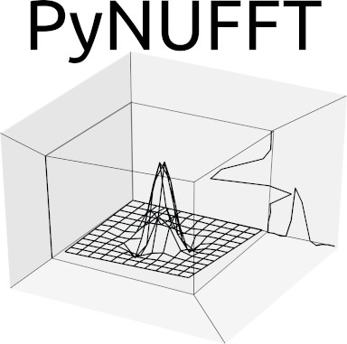

# PyNUFFT: Python non-uniform fast Fourier transform

A minimal "getting start" tutorial is available at http://jyhmiinlin.github.io/pynufft/ .
 
## Installation

$ pip install pynufft --user

## How to use?

### Using Numpy/Scipy

```
$ python
Python 3.6.11 (default, Aug 23 2020, 18:05:39) 
[GCC 7.5.0] on linux
Type "help", "copyright", "credits" or "license" for more information.
>>> from pynufft import NUFFT
>>> import numpy
>>> A = NUFFT()
>>> om = numpy.random.randn(10,2)
>>> Nd = (64,64)
>>> Kd = (128,128)
>>> Jd = (6,6)
>>> A.plan(om, Nd, Kd, Jd)
0
>>> x=numpy.random.randn(*Nd)
>>> y = A.forward(x)
```

### Using PyCUDA

```
>>> from pynufft import NUFFT, helper
>>> import numpy
>>> A2= NUFFT(helper.device_list()[0])
>>> A2.device
<reikna.cluda.cuda.Device object at 0x7f9ad99923b0>
>>> om = numpy.random.randn(10,2)
>>> Nd = (64,64)
>>> Kd = (128,128)
>>> Jd = (6,6)
>>> A2.plan(om, Nd, Kd, Jd)
0
>>> x=numpy.random.randn(*Nd)
>>> y = A2.forward(x)
```
### Contact information
email: pynufft@gamil.com
